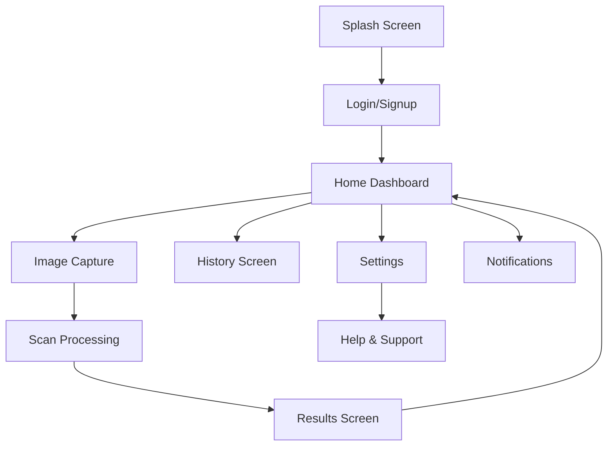

# High Intraocular Pressure (IOP) Detection App

<div align="center">
  
  <h3>Early Detection for Healthy Vision</h3>
</div>

## 📋 Table of Contents

- [Introduction](#introduction)
- [Tech Stack](#tech-stack)
- [Database Schema](#database-schema)
- [Project Structure](#project-structure)
- [Design Principles](#design-principles)
- [App Flow](#app-flow)
- [Screen Descriptions](#screen-descriptions)
- [Detailed Screen Specifications](#detailed-screen-specifications)
- [Popups & Modals](#popups--modals)
- [User Flow](#user-flow)
- [Security & Privacy](#security--privacy)
- [ML Model Details](#ml-model-details)

## 🔍 Introduction

The **High IOP Detection App** provides a non-invasive solution for detection of high intraocular pressure using fundus images. Designed with accessibility in mind, particularly for elderly users, the app features a simple interface with large text and clear instructions.

## 💻 Tech Stack

| Component | Technology   | Details                             |
| --------- | ------------ | ----------------------------------- |
| Frontend  | React Native | - Cross-platform mobile development |
|           |              | - Expo managed workflow             |
|           |              | - React Navigation for routing      |
|           |              | - React Native Paper UI components  |
| Backend   | Firebase     | - Authentication                    |
|           |              | - Cloud Firestore database          |
|           |              | - Cloud Storage for images          |
|           |              | - Cloud Functions                   |
| ML Model  | TensorFlow   | - Custom trained model              |
|           | Lite         | - On-device inference               |
|           |              | - Optimized for mobile              |
| CI/CD     | GitHub       | - Automated testing                 |
|           | Actions      | - Build and deployment              |
|           |              | - Code quality checks               |

## 📊 Database Schema

### Firestore Collections

#### 1. users

```typescript
{
  uid: string;              // Firebase Auth UID
  email: string;            // User's email address
  fullName: string;         // User's full name
  dateOfBirth: timestamp;   // User's date of birth
  gender: string;           // User's gender
  phoneNumber: string;      // Optional contact number
  createdAt: timestamp;     // Account creation date
  lastLogin: timestamp;     // Last login timestamp
  preferredLanguage: string;// 'en' or 'ar'
  notificationSettings: {   // Notification preferences
    scanReminders: boolean,
    appointmentAlerts: boolean,
    resultNotifications: boolean
  }
}
```

#### 2. scans

```typescript
{
  scanId: string;          // Unique scan identifier
  userId: string;          // Reference to users collection
  imageUrl: string;        // URL to fundus image in Storage
  thumbnailUrl: string;    // URL to compressed thumbnail
  timestamp: timestamp;    // When scan was taken
  result: {
    iopLevel: string,     // 'HIGH' or 'NORMAL'
    confidence: number,   // AI model confidence (0-1)
    pressureEstimate: number // Estimated IOP value
  },
  notes: string;          // Optional medical notes
  deviceInfo: {           // Capture device information
    model: string,
    osVersion: string,
    appVersion: string
  },
  status: string;         // 'PENDING', 'COMPLETED', 'FAILED'
}
```

#### 3. medicalHistory

```typescript
{
  userId: string;         // Reference to users collection
  conditions: [{
    name: string,        // Medical condition name
    diagnosedDate: timestamp,
    medications: string[]
  }],
  familyHistory: [{
    condition: string,   // Medical condition name
    relationship: string // Relationship to user
  }],
  lastUpdated: timestamp // Last update timestamp
}
```

#### 4. appointments

```typescript
{
  appointmentId: string;  // Unique appointment identifier
  userId: string;        // Reference to users collection
  doctorName: string;    // Healthcare provider name
  date: timestamp;       // Appointment date and time
  type: string;          // 'FOLLOW_UP', 'REGULAR_CHECK', 'EMERGENCY'
  notes: string;         // Additional appointment notes
  status: string;        // 'SCHEDULED', 'COMPLETED', 'CANCELLED'
  reminder: {            // Reminder settings
    enabled: boolean,
    timing: number      // Minutes before appointment
  }
}
```

## 📁 Project Structure

```
/
├── src/
│   ├── assets/            # Static assets (images, fonts)
│   ├── components/        # Reusable UI components
│   │   ├── common/        # Shared components (buttons, inputs)
│   │   └── screens/       # Screen-specific components
│   ├── navigation/        # Navigation configuration
│   ├── screens/           # Main application screens
│   │   ├── Auth/          # Login and registration screens
│   │   ├── Dashboard/     # Home and main dashboard
│   │   ├── Scan/          # Image capture and processing
│   │   ├── Results/       # Scan results and recommendations
│   │   ├── History/       # Past scans and trends
│   │   └── Settings/      # User preferences and app settings
│   ├── services/          # API and backend services
│   │   ├── api/           # API client and endpoints
│   │   ├── auth/          # Authentication services
│   │   └── ml/            # Machine learning model integration
│   ├── store/             # State management
│   │   ├── actions/       # Redux actions
│   │   ├── reducers/      # Redux reducers
│   │   └── selectors/     # State selectors
│   ├── utils/             # Helper functions and utilities
│   └── App.tsx            # Root application component
├── firebase/              # Firebase configuration
├── docs/                  # Documentation
├── __tests__/             # Test files
├── android/               # Android-specific files
├── ios/                   # iOS-specific files
└── package.json           # Project dependencies
```

## 🎨 Design Principles

| Principle            | Implementation                                                |
| -------------------- | ------------------------------------------------------------- |
| **Accessibility**    | Large, readable text using **Inter font**                     |
| **Intuitive Layout** | Minimal design with large touch targets                       |
| **Navigation**       | iOS-style navigation bar for key features                     |
| **Color Scheme**     | Soft blue and white with high contrast                        |
| **Visual Clarity**   | Minimal icons with text labels                                |
| **User Experience**  | Designed for elderly users with frustration-free interactions |

## 🔄 App Flow



1. **Open App** → Splash Screen
2. **Authenticate** → Login or Sign Up
3. **Navigate Dashboard** → Central hub for all features
4. **Scan** → Capture or upload fundus image
5. **Process** → AI model classifies IOP level
6. **Review Results** → View classification with recommendations
7. **Track Progress** → Access scan history and trends

## 📱 Screen Descriptions

### 1. Splash Screen

- **Content:** App logo and tagline "Early Detection for Healthy Vision"
- **Design:** Soft blue background with fade-in animation
- **Duration:** 2-3 seconds before transitioning

### 2. Login/Signup Screen

- **Authentication Options:**
  - Email/password login
  - "Forgot Password?" recovery option
- **Design Features:**
  - Large input fields
  - Clearly labeled buttons
  - Simple layout with minimal distractions

### 3. Home Dashboard

<div align="center">
  
</div>

- **Main Components:**
  - Prominent "Scan Now" button
- **Navigation:** iOS-style bottom bar for easy switching between sections (Home, History, Settings)

### 4. Image Capture & Upload Screen

- **Camera Features:**
  - Live viewfinder
  - Fundus alignment guide
  - Capture button
  - Upload existing image option
- **Guidance:** Real-time instructions for optimal positioning

### 5. Scan Results Screen

- **Result Display:**
  - Large text output: "High IOP Detected" or "IOP is Normal"
  - Color-coded results (Green = Normal, Red = High)
- **Next Steps:**
  - Recommendations based on results
  - Option to save or share results
  - Return to Home button

### 6. History Screen

- **Content:**
  - Chronological list of past scans
  - Date and time stamps
  - Color-coded result indicators
- **Interaction:**
  - Tap to view detailed results
  - Filter options by date or result

### 7. Settings Screen

- **Preferences:**
  - Language selection (English, Arabic, etc.)
  - Theme toggle (Light/Dark mode)
  - Notification preferences
- **Account:**
  - Profile management
  - Data export options
  - Logout function

### 8. Help & Support Screen

- **Resources:**
  - Frequently Asked Questions
  - Tutorial videos
  - Contact support options
- **Educational Content:**
  - Information about IOP and glaucoma
  - Best practices for eye health

### 9. Notifications Screen

- **Alert Types:**
  - Scan reminders
  - Result notifications
  - Appointment suggestions
- **Controls:**
  - Dismiss or snooze options
  - Notification preference settings

## 📱 Detailed Screen Specifications

### 1. Splash Screen
- **Title:** EyeCare
- **Subtitle:** Early Detection for Healthy Vision
- **Icon:** A blue eye logo centered on the screen
- **Background:** Light grayish-blue
- **Purpose:** The splash screen serves as the first visual introduction to the app, loading before transitioning to authentication screens

### 2. Sign-Up Screen
- **Title:** Welcome
- **Subtitle:** Sign up to continue
- **Form Fields:**
  - Full Name (Placeholder: Enter your name)
  - Email Address (Placeholder: Enter your email)
  - Password (Placeholder: Enter your password)
- **Buttons:**
  - Sign Up (Blue Button)
- **Bottom Text:** Already have an account? Sign in (Clickable)
- **Purpose:** Allows new users to create an account by entering their details

### 3. Login Screen
- **Title:** Welcome Back
- **Subtitle:** Sign in to continue
- **Form Fields:**
  - Email Address (Placeholder: Enter your email)
  - Password (Placeholder: Enter your password)
- **Links and Buttons:**
  - Forgot Password? (Clickable)
  - Login (Blue Button)
- **Bottom Text:** Don't have an account? Sign up (Clickable)
- **Purpose:** Allows registered users to log in or recover their password

### 4. Home Screen (Dashboard)
- **Greeting:** Good morning, [User's Name]
- **Recent Activity Section:**
  - Text: Eye scan completed
  - Date: 2 days ago
- **Primary Action Button:** Scan Now (Large Blue Button with Camera Icon)
- **Informational Text:**
  - This app is designed to test an innovative deep learning model that detects high intraocular pressure (IOP) using a fundus image scan of the eye.
  - Developed by students at MSA University, this tool aims to make early detection of high IOP more accessible and convenient.
  - To learn more about the science behind this project, check out the full research paper here: Read the Paper (Clickable)
- **Bottom Navigation Bar:**
  - Home (Highlighted in Blue)
  - History
  - Settings
- **Purpose:** This is the main hub of the app where users can view recent activity and initiate new scans

### 5. Eye Scan Screen
- **Title:** Eye Scan
- **Instruction:** Center your fundus image in the frame
- **Visual:** A circular frame in the center for aligning the eye scan
- **Buttons:**
  - Upload Photo (Gray Button with Image Icon)
  - Camera Button (Blue Button with Camera Icon)
- **Purpose:** This screen enables users to capture or upload an image for IOP analysis

### 6. Scan Results Screen
- **Timestamp:** February 15, 2025 - 2:30 PM
- **Alert Message:** High IOP Detected (Large Red Warning)
- **Details:** High intraocular pressure detected – please consult an eye care professional as soon as possible
- **Buttons:**
  - Schedule Appointment (Blue Button)
  - Back to Home (Gray Button)
- **Bottom Navigation Bar:** Home, History, Settings
- **Purpose:** Displays the results of the eye scan, warning the user if high intraocular pressure is detected

### 7. Scan History Screen
- **Title:** Scan History
- **Sections:**
  - Today
    - 10:00 AM - High (Red Indicator)
    - 8:30 AM - Normal (Green Indicator)
  - Yesterday
    - 9:15 PM - Normal (Green Indicator)
  - Earlier
    - 2:45 PM (Jan 3, 2025) - High (Red Indicator)
- **Bottom Navigation Bar:** Home, History (Highlighted), Settings
- **Purpose:** Allows users to track their previous scan results over time

### 8. Settings Screen
- **User Profile Section:**
  - Profile Picture
  - Name: John Smith
  - Email: john.smith@example.com
  - Edit Profile Button
- **Settings Options:**
  - Language: English (Dropdown)
  - Dark Mode Toggle (Currently Off)
  - Log Out Button (Red)
- **Purpose:** Provides user settings for language, appearance, and profile management

### 9. Help & Support Screen
- **Title:** Help & Support
- **FAQ Section:**
  - How do I take a good fundus image scan?
    - Find a well-lit area, hold your device at eye level, and ensure your scan is centered in the frame. Keep steady and follow the on-screen guidelines.
  - What do the results mean?
    - Your results provide an assessment of your eye health. Green indicates normal, yellow suggests monitoring, and red requires immediate attention.
  - How often should I perform a scan?
    - We recommend monthly scans for regular monitoring. If you notice any changes, perform additional scans as needed.
- **Contact Support Section:**
  - Call Support: 1-800-123-4567
  - Email Support: support@example.com
- **Purpose:** Provides users with helpful information and support resources

## 💬 Popups & Modals

### Error Messages

- **Unclear Image:**
  ```
  ⚠️ Image unclear. Please retake the photo.
  [Retry] [Cancel]
  ```

- **Network Error:**
  ```
  ⚠️ Connection lost. Please check your internet connection.
  [Try Again] [Cancel]
  ```

### Success Confirmations

- **Scan Completion:**
  ```
  ✅ Scan completed successfully!
  [View Results] [Back to Home]
  ```

- **Profile Update:**
  ```
  ✅ Profile updated successfully!
  [OK]
  ```

### Permission Requests

- **Camera Access:**
  ```
  Allow "High IOP App" to access your camera?
  This is required for fundus scanning functionality.
  [Don't Allow] [Allow]
  ```

- **Notifications:**
  ```
  Allow "High IOP App" to send you notifications?
  You'll receive important reminders and results.
  [Don't Allow] [Allow]
  ```

## 👤 User Flow

1. **Initial Launch**

   - App opens to splash screen
   - Transitions to login/signup if not authenticated

2. **Dashboard Navigation**

   - User accesses central hub
   - All main features accessible from this screen

3. **Scanning Process**

   - User initiates scan
   - Captures or uploads fundus image
   - AI processes and classifies IOP level

4. **Result Review**

   - User views classification
   - Receives appropriate recommendations:
     - **Normal IOP:** Regular monitoring schedule
     - **High IOP:** Consult specialist promptly

5. **History & Tracking**

   - User reviews past scans
   - Monitors trends over time
   - Exports data if needed

6. **Settings & Support**
   - User customizes preferences
   - Accesses help resources
   - Manages account settings

## 🔒 Security & Privacy

- End-to-end encryption for all user data
- HIPAA-compliant storage practices
- User control over data sharing
- Option to delete account and all associated data
- Regular security audits and updates
- Transparent privacy policy with clear data usage terms

## 🧠 ML Model Details

### Model Architecture
- **Type:** Convolutional Neural Network (CNN)
- **Framework:** TensorFlow Lite
- **Base Model:** MobileNetV2 (transfer learning)
- **Input Size:** 224x224x3 (RGB fundus images)
- **Output:** Binary classification (Normal/High IOP)

### Training Details
- **Dataset:** 10,000+ annotated fundus images
- **Validation Accuracy:** 92.5%
- **Sensitivity:** 94.3%
- **Specificity:** 91.8%

### On-Device Implementation
- Model size: <5MB (optimized for mobile)
- Average inference time: <2 seconds
- Runs locally without internet connection
- Periodic model updates via app updates

### Clinical Validation
- Validated against traditional tonometry measurements
- Tested in clinical settings with ophthalmologists
- Not intended to replace professional medical diagnosis

---

<div align="center">
  <p><strong>High IOP Detection App</strong> - Making eye health monitoring accessible to everyone</p>
  <p>© 2023 High IOP Detection Team. All rights reserved.</p>
</div>
